# Test Evidences

## Creating a person

- Using http request POST `(/api/person)` to create a new person

  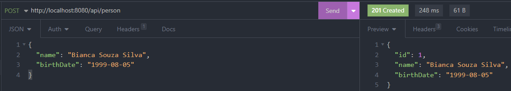

  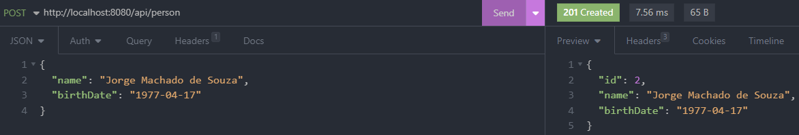
- Entity created shown in H2 database

  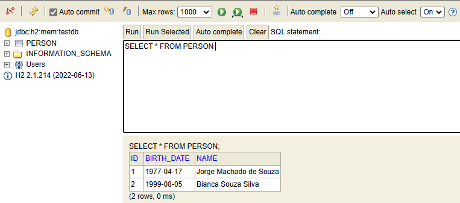

---

## Updating a person

- Using http request PUT `(/api/person/{id})` to update person's data

  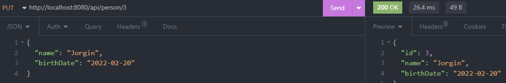
- Entity updated shown in H2 database

  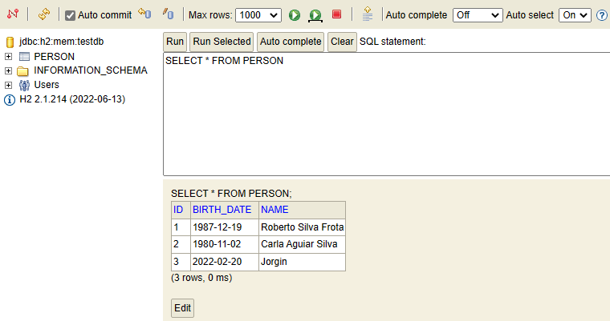

---

## Deleting person's data

- Using http request DELETE `(/api/person/{id})` to delete person's data

  
- Table updated without person number 3 shown in H2 database

  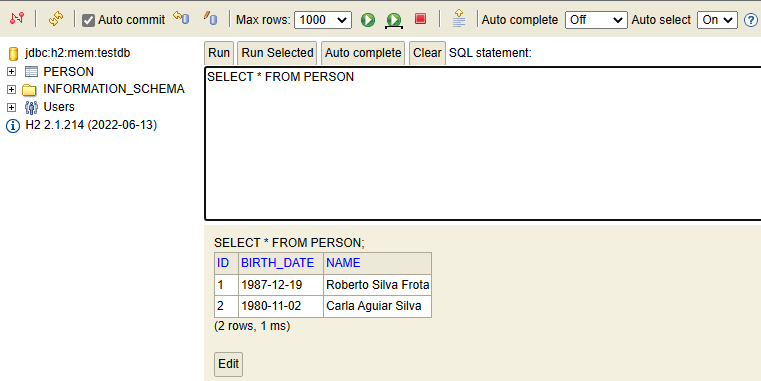

---

## Reading person's data

- Using http request GET `(/api/person/{id})` to get person's data

  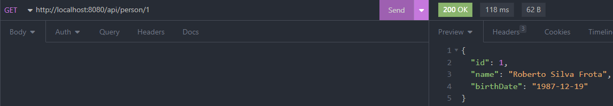

## Reading all people's data

- Using http request GET `(/api/person)` to get all people's data

  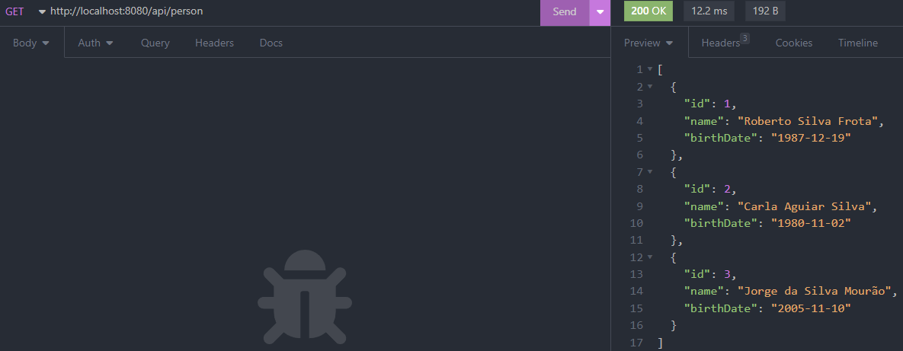

## Creating an address for a person

- Using http request GET `(/api/person/{id})` to get person's data

  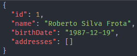
- Using http request POST `(/api/person/{id}/addresses)` to create an address and associate with a person

  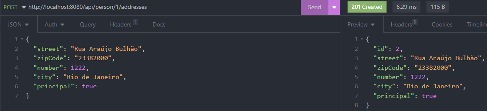
- 
- 
- 
- 
- 
- Using http request GET `(/api/person/{id})` to get person's data with the added address

  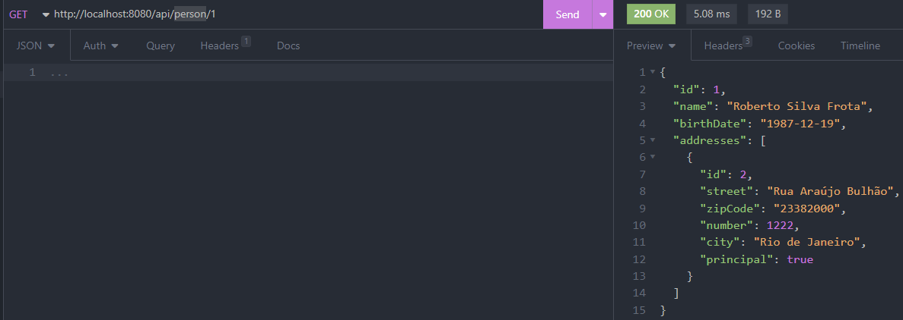

  ## Retrieving all person's addresses
- Using http request GET `(/api/person/{id})` to get person's data with all the addresses

  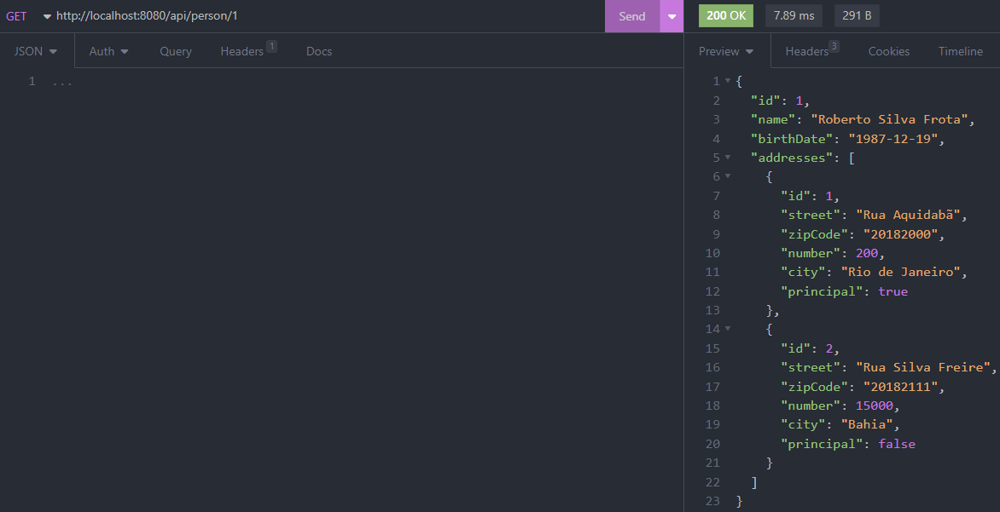
- Using http request GET `(/api/person/{id}/addresses)` to get all addresses for this person

  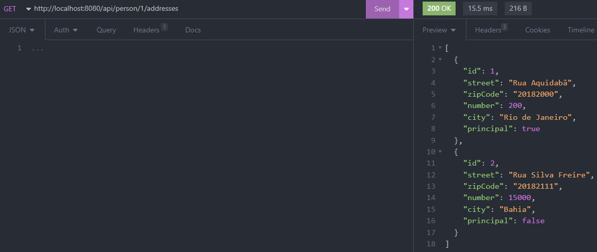
