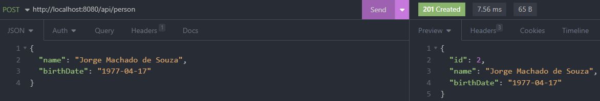

# Evidência de Testes

## Criando uma pessoa

- Usando requisição HTTP POST `(/api/person)` para criar uma pessoa

  

  
- Entidades criadas mostradas no banco de dados H2

  

---

## Atualizando uma pessoa

- Usando requisição HTTP PUT `(/api/person/{id})` para atualizar dados da pessoa

  
- Entidade atualizada mostrada no banco de dados H2

  

---

## Deletando dados de uma pessoa

- Usando requisição HTTP DELETE `(/api/person/{id})` para apagar dados da pessoa

  
- Atualização da tabela sem a pessoa de id número 3 no banco de dados H2

  

---

## Lendo dados da pessoa

- Usando requisição HTTP GET `(/api/person/{id})` para recuperar dados de uma pessoa

  

## Lendo todos os dados das pessoas

- Usando requisição HTTP GET `(/api/person)` para recuperar todos os dados das pessoas

  

## Criando endereço para pessoa

- Usando requisição HTTP GET `(/api/person/{id})` para recuperar dados da pessoa

  
- Usando requisição HTTP POST `(/api/person/{id}/addresses)` para criar um endereço e associá-lo a pessoa

  
- Usando requisição HTTP POST `(/api/person/{id})` para recuperar dados da pessoa com o endereçõ adicionado

  

  ## Recuperando todos os endereços da pessoa
- Usando requisição HTTP GET `(/api/person/{id})` para recuperar dados da pessoa com todos os endereços

  
- Usando requisição HTTP GET `(/api/person/{id}/addresses)` para recuperar todos endereços dessa pessoa

  

  ---

  ## Recuperando endereço principal de uma pessoa
- Usando requisição HTTP GET `(/api/person/{id})` para recuperar dados de uma pessoa

  
- Usando requisição HTTP GET `(/api/person/{id}/addresses/main)` para recuperar endereço principal da pessoa

  
